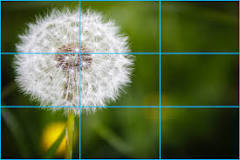
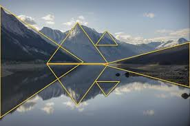

# Fotografía

   

   La fotografía es una disciplina técnica y artística que consiste en capturar y reproducir imágenes por medio de la acción de la luz proyectada y fijada sobre un medio sensible, ya sea físico o digital [(Concepto, 2020)](https://concepto.de/fotografia/#:~:text=La%20fotograf%C3%ADa%20es%20una%20disciplina,ya%20sea%20f%C3%ADsico%20o%20digital.).

## Composición fotográfica

- La composición fotográfica es el modo en que un fotógrafo dispone los elementos visuales en su encuadre. **_"Es una gratificante organización de objetos dentro de tu rectángulo"_**, afirma el fotógrafo Adam Long. Poner motivos o escenas dentro de ese espacio puede sonar a tarea fácil, pero es todo menos eso. [(Adobe, 2023)](https://www.adobe.com/ar/creativecloud/photography/discover/photo-composition.html#:~:text=La%20composici%C3%B3n%20fotogr%C3%A1fica%20es%20el,pero%20es%20todo%20menos%20eso.).
  
     
         1. Regla de los tercios.
         2. Ley de la mirada.
         3. Proporción Aurea.
         4. Simetría.
         5. Impares.
         6. Enfoque y desenfoque.
         7. Llenar el encuadre.
   

  

- **Figura 1.** La regla de los tercios es la técnica de composición mas usada en la fotografía

 

- **Figura 2.** Se puede jugar con la geometría para realizar composiciones más interesantes.
  
